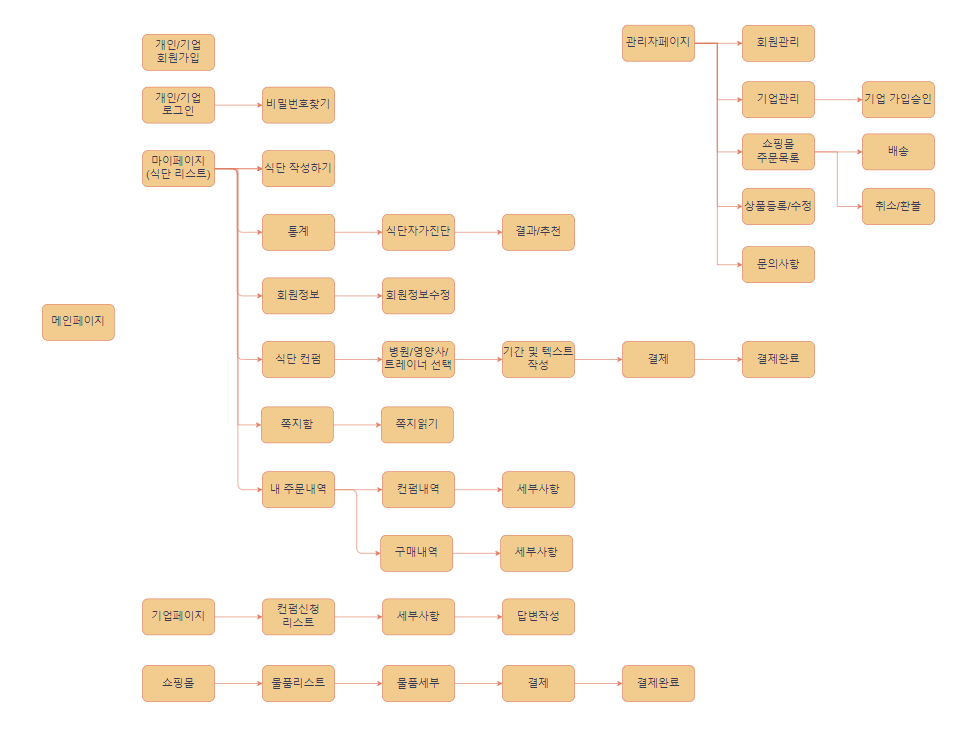
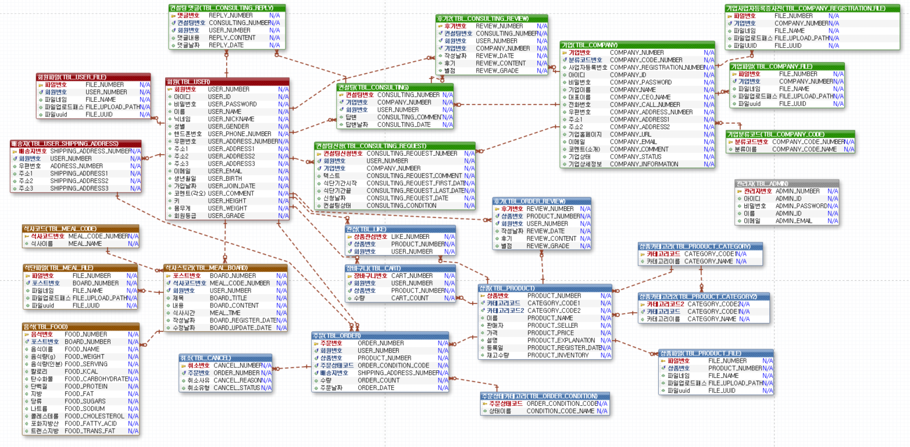

# MealMe🍖
- 식단 기록과 전문가의 컨설팅, 쇼핑몰 웹사이트

## 😋 프로젝트 소개
- 내 식단을 기록하고 쉽게 식사에 대한 정보를 확인할 수 있는 플랫폼입니다.
- 식단을 기록할때 식품의약품안전처의 "식품영양성분DB" api를 사용하여 음식이름으로 검색 후 식품의 정확한 세부 데이터를 받아 와 기록할 수 있습니다.
- 내 정보에 따라서 권장 칼로리 계산해주고 기록된 식단의 영양분을 차트로 확인할 수 있어 부족한 영양분에 대해 알 수 있습니다.
- 기록된 식단을 쉽고 빠르게 컨설팅 받을 수 있습니다.
- 나에게 필요한 식품을 쇼핑몰에서 구매할 수 있습니다.
 

## 🕰️ 개발 기간
* 23.05.24일 - 23.07.24일

## 🧑‍🤝‍🧑 맴버구성
 - 팀장   : 이재우 - 헤더, 푸터, 사이드바, 퀵메뉴, 메인페이지, (개인/기업)로그인, 카카오로그인, 회원가입,
             비밀번호 찾기(메일전송), (개인/기업)회원정보 수정, 마이페이지, 식단 입력, 쇼핑몰, 관리자로그인, DB테이블 설계, git관리, 발표 
 - 부팀장 : 이동재 - 관리자 페이지(회원관리, 기업회원가입승인, 쇼핑몰 상품등록, 결제정보확인)
 - 팀원1  : 김예슬 - 차트 페이지(오늘하루, 일간, 주간, 월간), 구매 목록, 리뷰작성, 리뷰 목록, 발표 PPT 제작
 - 팀원2  : 유정현 - 컨설팅 읽기 및 답변, 답변 읽기
 - 팀원3  : 정연재 - 기업리스트, 컨설팅 신청

## ⚙️ 개발 환경
- `Java 11`
- `JDK 11.0.15`
- **Database** : Oracle
- **ORM** : Mybatis

## 📌 주요 서비스
### 로그인/회원가입
- (개인/기업)선택 후 로그인
- 로그인 시 쿠키(Cookie) 및 세션(Session)생성
- ID, 닉네임 중복검사
- 비밀번호 정규 표현식 텍스트 입력
- 회원가입 시 카카오 주소 api 사용
- 기업 회원가입시 사업자등록증(파일첨부)
- 비밀번호 암호화 sha256 사용

### 회원정보수정
- 프로필 사진, 닉네임, 한줄소개 ajax 처리
- 비밀번호 정규 표현식 텍스트 입력

### 비밀번호 찾기
- 구글메일 api 사용
- 비밀번호 찾을 시 랜덤한 6자리 코드로 바꾸고 암호화 시켜 비밀번호 변경 후 메일로 6자리 코드 전송

### 식사입력/보기
- 날짜 입력
- 식품영양성분DB api를 사용해서 음식이름 검색 후 받아온 데이터에서 내가 먹은 음식 선택
- 음식을 리스트로 저장
- 음식 사진 첨부 가능
- SummerNote 사용
- 일별로 식사 리스트, 식사별로 음식과 음식에 대한 데이터 불러옴
- 

### 차트
- chart.js 사용
- 오늘 하루 식사 데이터 확인
- 일별, 주별, 월별 식사 데이터 평균 확인 가능

### 컨설팅
- 기업 정보가 담긴 리스트로 기업확인
- 원하는 기업 선택 후 기간

### 쇼핑몰

### 관리자

## 맡은 서비스
### - fragment  - <a href="" >상세보기 - WIKI 이동</a>
### - 로그인  - <a href="" >상세보기 - WIKI 이동</a>
### - 회원가입  - <a href="" >상세보기 - WIKI 이동</a>
### - 회원정보수정  - <a href="" >상세보기 - WIKI 이동</a>
### - 비밀번호찾기  - <a href="" >상세보기 - WIKI 이동</a>
### - 식사입력  - <a href="" >상세보기 - WIKI 이동</a>
### - 식사보기  - <a href="" >상세보기 - WIKI 이동</a>
### - 쇼핑몰  - <a href="" >상세보기 - WIKI 이동</a>
### - 암호화  - <a href="" >상세보기 - WIKI 이동</a>
### - 인터셉터  - <a href="" >상세보기 - WIKI 이동</a>

##  흐름도

## ERD

